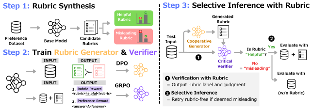

# C2: Rubric-Augmented Reward Modeling from Binary Preferences

This repository contains the official implementation of the paper "C2: Rubric-Augmented Reward Modeling from Binary Preferences".
C2 enables rubric-augmented reward modeling from binary preference data alone. 
At test time, a rubric generator trained on synthesized rubrics collaborates with a reward model to produce nuanced, fine-grained LLM-as-a-judge evaluations.

[](assets/c2_overview.svg)

## Abstract

Rubric-augmented verification can act as a more reliable proxy for human judgment than single-model verification.
However, most methods require rubric annotations on top of binary preferences, making them less scalable than conventional reward modeling.
We propose Cooperative yet Critical reward modeling (C2), a framework that realizes rubric-augmented verification from binary preferences alone.
C2 synthesizes contrastive rubric pairs (helpful versus misleading) by measuring how each rubric shifts the verifier's confidence toward or away from the correct preference.
From this augmented dataset, we jointly train a cooperative rubric generator that proposes criteria to guide the verifier, and a critical verifier that reasons about rubric validity before making its judgment.
This is motivated by our finding that low-quality rubrics do more harm than help.
At inference time, the verifier selectively follows rubrics it deems helpful and reverts to rubric-free evaluation otherwise.
C2 outperforms reasoning reward models trained on the same binary preferences, with gains of up to 6.5 points on RM-Bench and 6.0 points length-controlled win rate on AlpacaEval 2.0.
Without external rubric annotations, C2 enables an 8B reward model to match performance achieved with rubrics from a 4× larger model.
Our work demonstrates that eliciting cooperation between models enables verification beyond single-model capabilities.

## Installation

Install the project with `uv`:

```bash
uv sync
```

This installs the package and exposes the following CLI entry points:

- `c2-synthesize-rubrics`
- `c2-train-generator-dpo`
- `c2-train-verifier-grpo`
- `c2-infer`

## Getting Started

### Input data

The loader accepts one pairwise format:

`prompt + response_a + response_b + label`

```json
{
  "id": "ex_0002",
  "prompt": "Explain why the sky is blue.",
  "response_a": "...",
  "response_b": "...",
  "label": "A"
}
```

### Run the full pipeline

The simplest entry point is the shell launcher:

```bash
cd C2
bash scripts/run_c2.sh \
  --model-name allenai/Llama-3.1-Tulu-3-8B-SFT \
  --dataset-path /path/to/pairwise_train.jsonl \
  --output-root /path/to/c2_run
```

This command produces:

- `data/contrastive_rubric_pairs.jsonl`
- `data/generator_contrastive_pairs.jsonl`
- `data/rubric_augmented_examples.jsonl`
- `generator/`
- `verifier/`

### Run each stage manually

#### 1. Synthesize contrastive rubric pairs

```bash
uv run c2-synthesize-rubrics \
  --dataset-path /path/to/pairwise_train.jsonl \
  --model-name allenai/Llama-3.1-Tulu-3-8B-SFT \
  --output-path /path/to/contrastive_rubric_pairs.jsonl \
  --generator-contrastive-pairs-path /path/to/generator_contrastive_pairs.jsonl \
  --rubric-augmented-examples-path /path/to/rubric_augmented_examples.jsonl
```

#### 2. Train the rubric generator

```bash
uv run c2-train-generator-dpo \
  --dataset-path /path/to/generator_contrastive_pairs.jsonl \
  --model-name allenai/Llama-3.1-Tulu-3-8B-SFT \
  --output-dir /path/to/generator
```

The generator is trained with DPO on `(context, helpful rubric, misleading rubric)` triples.

#### 3. Train the verifier

```bash
uv run c2-train-verifier-grpo \
  --original-dataset-path /path/to/pairwise_train.jsonl \
  --rubric-augmented-examples-path /path/to/rubric_augmented_examples.jsonl \
  --model-name allenai/Llama-3.1-Tulu-3-8B-SFT \
  --output-dir /path/to/verifier
```

The verifier is trained on a mixture of rubric-free and rubric-augmented tasks. 

#### 4. Run selective inference

```bash
uv run c2-infer \
  --dataset-path /path/to/pairwise_eval.jsonl \
  --generator-model /path/to/generator \
  --verifier-model /path/to/verifier \
  --output-path /path/to/predictions.jsonl
```

At inference time, the generator proposes a rubric, the verifier decides whether that rubric is `helpful` or `misleading`, and the system falls back to rubric-free verification when the rubric should not be trusted.

## Citation

TBA.
